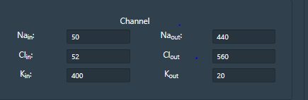
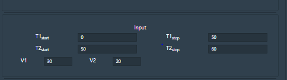
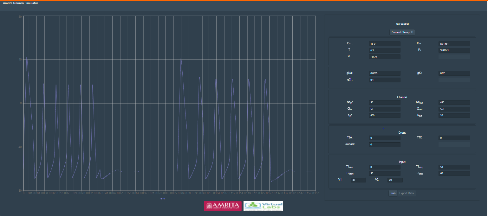
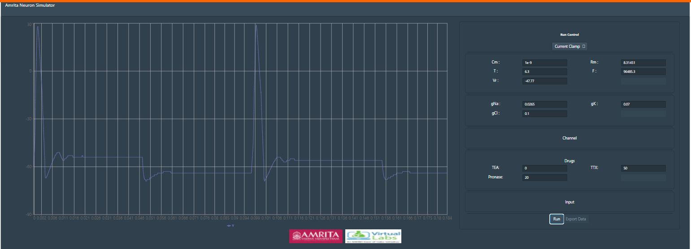
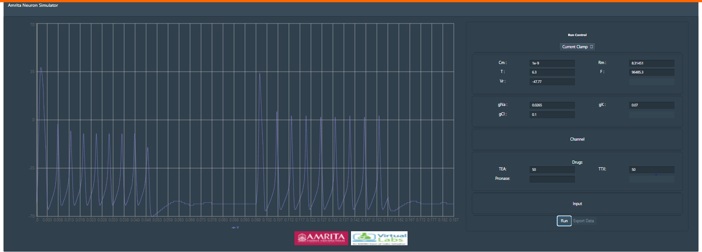

### Procedure

&nbsp;

#### Parameters in the simulator window

Cm  = Membrane Capacitance

Rm  = Membrane resistance

Vr  = Resting Voltage

gNa = Conductance of Sodium ions

gK= Conductance of Potassium ions

gCl= Conductance of Chloride ions

T = Temperature

F= Frequency

&nbsp;

Channel windows indicates parameters for each of the active or passive ion channel types. Passive channels conductance can be varied in the channel window. This provides access to internal and external ionic concentration (Sodium, chloride and potassium) and membrane properties.
Voltage gated channels parameters can be accessed by clicking on channel details.

&nbsp;

 
&nbsp; 

Time is the input parameter and applied voltage is the stimuli. User can provide different values for the input parameters and can observe the change in output.
 

&nbsp;

 
&nbsp; 

**Default values for each parameters are provided in the simulator window. Click “Run” to execute simulation.**

&nbsp;

&nbsp; 
This indicate the action potential without any pharmacological blockers( Control Condition)

&nbsp;

After setting up your desired stimulus, provide values for “Drugs” at different concentration in percentage. Tetradotoxin selectively blocks voltage-sensitive Na+ channels; eliminates the initial Na+ current measured in voltage clamp experiments. Tetraethlyammonium: A quaternary ammonium compound that selectively blocks voltage-sensitive K+ channels; eliminates the delayed K+ current measured in voltage clamp experiments. Along with these drugs, another drug by name Pronase blocking sodium channel inactivation (acts as an antagonist to TTX). It’s been extensively used to analyze the kinetics of sodium channel activation.
Set the value of TTX as 50% and click on run button to study the effect of tetradoxin in action potential.

&nbsp;

 
&nbsp; 

This shows recorded action potential when 50% TTX applied (no TEA and pronase)
To study the effects of pronase an antagonist to TTX, provide the value of pronase as 20% concentration. Observe the change in nature of action potential. User can provide varying concentration as input and can study the effects of pharmacological blockers in action potential. User can also change the input parameters time and applied voltage and can study the effects in specific time window. 
 
&nbsp;

 
&nbsp; 

Then provide specific concentration of TEA and TTX, for example apply for 50% TEA and TTX. Execute simulation and can observe the change in the pattern of action potential.

&nbsp;

 
&nbsp; 

 
Here, TEA act as a probe to alter the structural and functional properties of potassium channels. It binds to the ion conduction pathway and inhibit the potassium ion flow in the cell membrane. tetraethylammonium (TEA), has no effect on the voltage-dependent changes in Na+ permeability. 

&nbsp;

Users can change the experiment mode to Voltage clamp and can study the effects of pharmaceutical drugs on voltage gated channels.

&nbsp;
 

Follow the steps as in Current clamp and study the effects of drugs in sodium and potassium channels.
Tetrodotoxin(TTX) blocks action potentials in nerves by binding to the voltage-gated, fast sodium channels in nerve cell membranes, essentially preventing any affected nerve cells from firing by blocking the channels used in the process. The effect of TTX drug can be simulated in Hodgkin and Huxley neuron by altering the conductance of sodium channels.

&nbsp;

 
&nbsp; 

Tetraethylammonium TEA, a potassium ion channel blocker. TEA is used in neurophysiological experiments to study potassium channels. The effect of TEA drug can be simulated in Hodgkin and Huxley neuron by altering the conductance of potassium channels.

&nbsp;

Pronase selectively destroys inactivation of the Na conductance (g(Na)).

